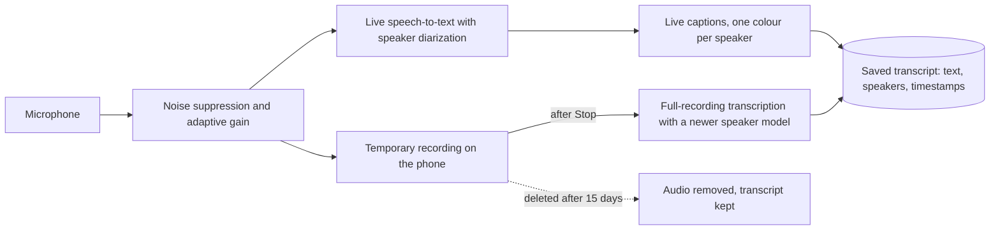

# Veribar

**An AI-powered Android app that listens to a conversation, shows what was said as live captions with a different colour for every speaker, and keeps an accurate, timestamped record of it afterwards.**

>
## The problem

After a meeting, a lecture or an important conversation, nobody remembers exactly who said what. Notes are incomplete, and recordings are too long to search. Veribar turns a conversation into a searchable, speaker-labelled transcript, so there is a reliable record of what was said.

## What it does

- Listens through the phone's microphone and shows **live captions** as people speak.
- Gives **each speaker their own colour**, so the conversation reads like a dialogue.
- After the conversation ends, **re-processes the whole recording** to produce a more accurate transcript and cleaner speaker labels.
- Stores every conversation on the phone with **timestamps and speakers**, with search, rename, delete and copy.
- Respects privacy: a **consent prompt** before each recording, **temporary audio** that is deleted after 15 days (the transcript stays), and no use of recordings for vendor model training.

## Screenshots

<table>
  <tr>
    <td align="center"> Ready to record</td>
    <td align="center"> Consent before every recording</td>
    <td align="center"> A colour per speaker, with timestamps</td>
    <td align="center"> History with search</td>
  </tr>
</table>

*The conversations shown are fictional samples created to demonstrate the interface.*

## How the AI pipeline works

1. **Live pass (speed).** Audio is streamed to a cloud speech-to-text service over a WebSocket. Words and speaker labels come back within about a second, so the captions feel immediate. Speaker labels at this stage are approximate, because the live speaker model sees only a short window of audio.
2. **Accurate pass (quality).** When recording stops, the whole recording is sent to the service's pre-recorded engine, which analyses all the audio at once with a newer speaker-separation model. The saved transcript is replaced with this version, and the screen updates by itself.
3. **Audio pre-processing.** Meetings and lectures often have quiet or distant speakers. The app applies the phone's built-in noise suppression (where available) and an **adaptive gain control** of up to 40x that only raises the volume while someone is actually speaking, so background noise between sentences is not amplified.
4. **Resilience.** If the live connection drops, recording continues and the accurate pass fills the gap afterwards. A failed accurate pass is retried the next time the app opens.

## Design decisions
| Why? |

| Two passes instead of one | Live feedback and high accuracy pull in opposite directions. Doing both gives instant captions and a better final record. |
| Temporary audio, permanent transcript | The audio is needed only to improve the transcript. Keeping it for 15 days limits how long sensitive recordings exist, while the useful record stays. |
| On-device storage | Transcripts stay on the phone, excluded from cloud backup and device transfer. |
| Opt-out from vendor model training | Meeting audio is sensitive, so it is excluded from the speech provider's model-improvement programme. |
| No API key in release builds | A key inside an app can be extracted from the APK. Release builds carry none, and distribution is planned around a small token-issuing server with short-lived credentials. |
| Consent before every recording | Many places require all participants to agree to being recorded. |

## Engineering challenges worth mentioning

- **Diagnosing silence.** Live captions returned empty text. By adding level logging and a "no sound" warning, the cause was traced to the test environment's microphone path rather than the app.
- **Performance measurement.** An animated background made the UI unresponsive on the emulator. Frame-timing measurements showed about 5 frames per second, caused by software rendering; moving to hardware graphics and halving the animation cost brought it to a steady 30 fps.
- **Using documentation, not memory.** Checking the speech provider's docs revealed that the speaker setting being used was deprecated and mapped to an older model, and that a newer one was available for recordings.
- **Honest security review.** The built app was inspected and the embedded key was readable, which led to key-free release builds, log scrubbing, enforced HTTPS and a written security plan.

## Tech

Kotlin, Jetpack Compose (Material 3), Android foreground service and `AudioRecord`, coroutines and Flow, OkHttp (WebSocket and streamed upload), Room database, a cloud speech-to-text API with speaker diarization (Deepgram Nova-3), R8 shrinking.
